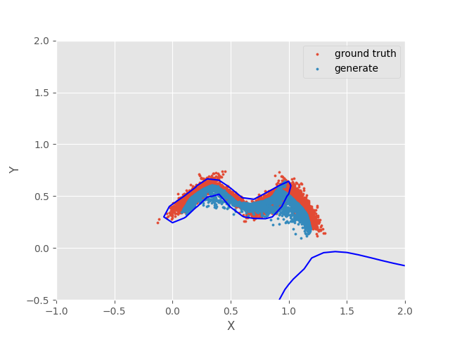
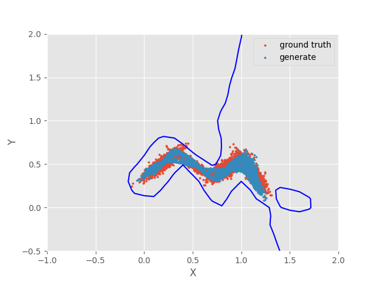

# 实验五

## 实验要求
- 生成式对抗网络实现
- 隐空间语义方向搜索

## 数据来源
```
./Dataset/points.mat
```
通过可视化，可以发现其为M。

## 目录结构
```
│  README.md
│  
├─Code
│  ├─Basic
│  │  │  argparser.py
│  │  │  config.py
│  │  │  dataset.py
│  │  │  Images2Mp4.sh
│  │  │  main.py
│  │  │  models.py
│  │  │  trainer.py
│  │  │  
│  │  └─__pycache__
│  │          *
│  │          
│  └─genforce
│      │  .gitignore
│      │  LICENSE
│      │  MODEL_ZOO.md
│      │  README.md
│      │  requirements.txt
│      │  sefa.py
│      │  synthesize.py
│      │  test.py
│      │  train.py
│      │  
│      ├─.idea
│      │  │  genforce.iml
│      │  │  modules.xml
│      │  │  workspace.xml
│      │  │  
│      │  └─inspectionProfiles
│      │          profiles_settings.xml
│      │          Project_Default.xml
│      │          
│      ├─checkpoints
│      │      pggan_celebahq1024.pth
│      │      
│      ├─configs
│      │      stylegan_demo.py
│      │      stylegan_ffhq1024.py
│      │      stylegan_ffhq1024_val.py
│      │      stylegan_ffhq256.py
│      │      stylegan_ffhq256_val.py
│      │      
│      ├─datasets
│      │      dataloaders.py
│      │      datasets.py
│      │      distributed_sampler.py
│      │      README.md
│      │      transforms.py
│      │      __init__.py
│      │      
│      ├─docs
│      │      synthesize_demo.ipynb
│      │      
│      ├─metrics
│      │      fid.py
│      │      inception.py
│      │      README.md
│      │      __init__.py
│      │      
│      ├─models
│      │  │  model_zoo.py
│      │  │  pggan_discriminator.py
│      │  │  pggan_generator.py
│      │  │  stylegan2_discriminator.py
│      │  │  stylegan2_generator.py
│      │  │  stylegan_discriminator.py
│      │  │  stylegan_generator.py
│      │  │  sync_op.py
│      │  │  __init__.py
│      │  │  
│      │  └─__pycache__
│      │          *
│      │          
│      ├─runners
│      │  │  base_gan_runner.py
│      │  │  base_runner.py
│      │  │  misc.py
│      │  │  optimizer.py
│      │  │  running_stats.py
│      │  │  stylegan_runner.py
│      │  │  __init__.py
│      │  │  
│      │  ├─controllers
│      │  │      base_controller.py
│      │  │      cache_cleaner.py
│      │  │      checkpointer.py
│      │  │      fid_evaluator.py
│      │  │      lr_scheduler.py
│      │  │      progress_scheduler.py
│      │  │      running_logger.py
│      │  │      snapshoter.py
│      │  │      timer.py
│      │  │      __init__.py
│      │  │      
│      │  └─losses
│      │          logistic_gan_loss.py
│      │          __init__.py
│      │          
│      ├─scripts
│      │      dist_test.sh
│      │      dist_train.sh
│      │      slurm_test.sh
│      │      slurm_train.sh
│      │      stylegan_training_demo.sh
│      │      
│      ├─utils
│      │  │  logger.py
│      │  │  logger_test.py
│      │  │  misc.py
│      │  │  visualizer.py
│      │  │  __init__.py
│      │  │  
│      │  └─__pycache__
│      │          misc.cpython-36.pyc
│      │          misc.cpython-37.pyc
│      │          misc.cpython-38.pyc
│      │          visualizer.cpython-36.pyc
│      │          visualizer.cpython-37.pyc
│      │          __init__.cpython-36.pyc
│      │          __init__.cpython-37.pyc
│      │          __init__.cpython-38.pyc
│      │          
│      └─work_dirs
│          └─synthesis
│              └─pggan_celebahq1024_N5_K5_seed0
│                  │  pggan_celebahq1024_N5_K5_seed0.mov
│                  │  
│                  └─frames
│                          frame0.png
│                          frame1.png
│                          frame2.png
│                          frame3.png
│                          frame4.png
│                          
├─Dataset
│      points.mat
│      
├─Report
│      frame0.png
│      frame1.png
│      frame2.png
│      frame3.png
│      frame4.png
│      GAN.png
│      GAN1.png
│      GAN2.png
│      GAN3.png
│      GAN4.png
│      GAN5.png
│      GAN6.png
│      GAN7.png
│      GAN8.png
│      GAN9.png
│      GAN_Algorithm.png
│      refs.bib
│      Report.aux
│      Report.bbl
│      Report.blg
│      Report.log
│      Report.pdf
│      Report.synctex.gz
│      Report.tex
│      Report.toc
│      SeFa1.png
│      WGAN-GP1.png
│      WGAN-GP2.png
│      WGAN-GP3.png
│      WGAN-GP4.png
│      WGAN-GP5.png
│      WGAN-GP6.png
│      WGAN-GP7.png
│      WGAN-GP8.png
│      WGAN-GP9.png
│      WGAN-GP_Algorithm.png
│      WGAN1.png
│      WGAN2.png
│      WGAN3.png
│      WGAN4.png
│      WGAN5.png
│      WGAN6.png
│      WGAN7.png
│      WGAN8.png
│      WGAN9.png
│      WGAN_Algorithm.jpg
│      WGAN_Algorithm.png
│      
└─Trains
    ├─Images
    │  ├─GAN
    │  │      *
    │  │      
    │  ├─WGAN
    │  │      *
    │  │      
    │  └─WGAN-GP
    │         *
    │          
    ├─Logs
    ├─Models
    │      GAN_D.pkl
    │      GAN_G.pkl
    │      WGAN-GP_D.pkl
    │      WGAN-GP_G.pkl
    │      WGAN_D.pkl
    │      WGAN_G.pkl
    │      
    └─Videos
            GAN.mp4
            WGAN-GP.mp4
            WGAN.mp4
```


## 实验结果

### 生成式对抗网络实现
蓝色线条为D的决策面，红色点为points.mat中点的分布，蓝色点为生成的点。  
#### GAN


#### WGAN


#### WGAN-GP


### 隐空间语义方向搜索

  

<!--    -->

<!--     -->

<!--    -->

<!--    -->


## 参考

[笔记：SeFa，高效提取GAN隐空间的语义信息](https://zhuanlan.zhihu.com/p/165137416)


