# 哈工大模式识别与深度学习实验
欢迎Star⭐⭐⭐
## 实验一
### 实验要求
使用PyTorch实现MLP、CNN，并在MNIST数据集上验证。  
- 环境配置
- 代码编写
- 实验验证，在MNIST数据集上进行实验验证

### 训练
```shell
# 预处理数据
python3 ./Experiment1/Code/dataprocessed.py
# 训练模型
python3 train.py
```

### 实验效果
#### MLP
ACC:  
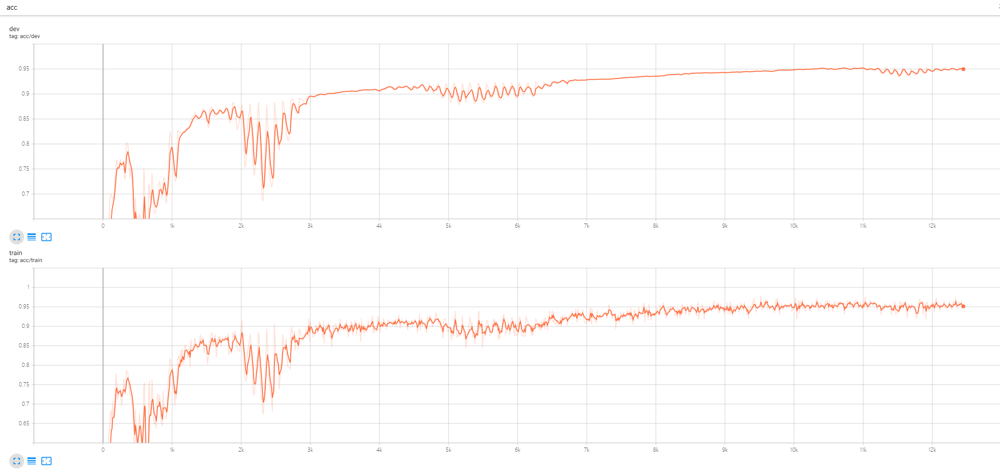  

Loss:  
  

confusion matrix:
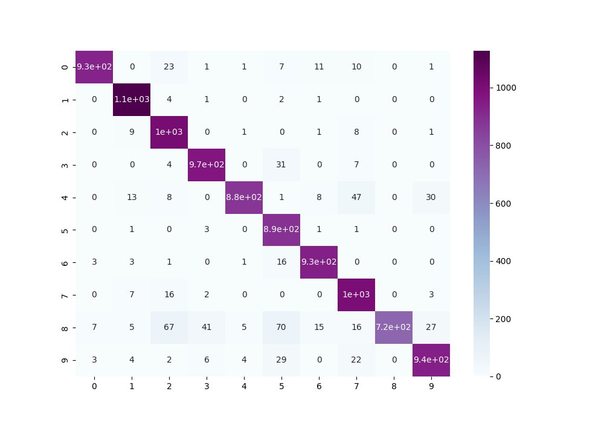  

#### CNN
ACC:  
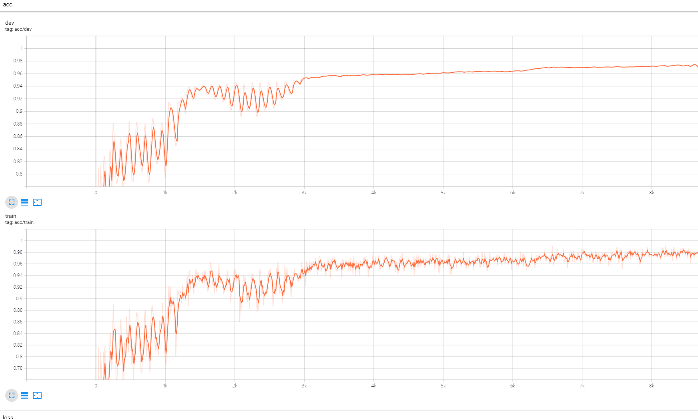  

Loss:  
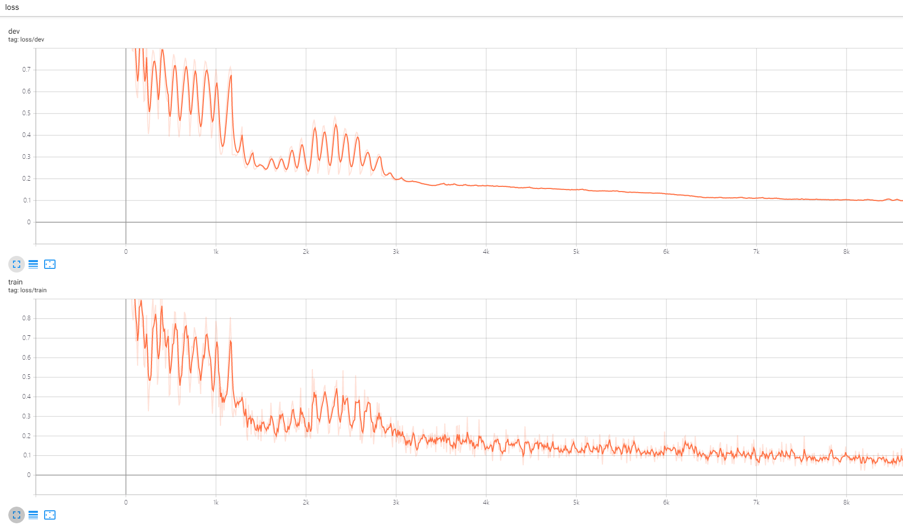  

confusion matrix:
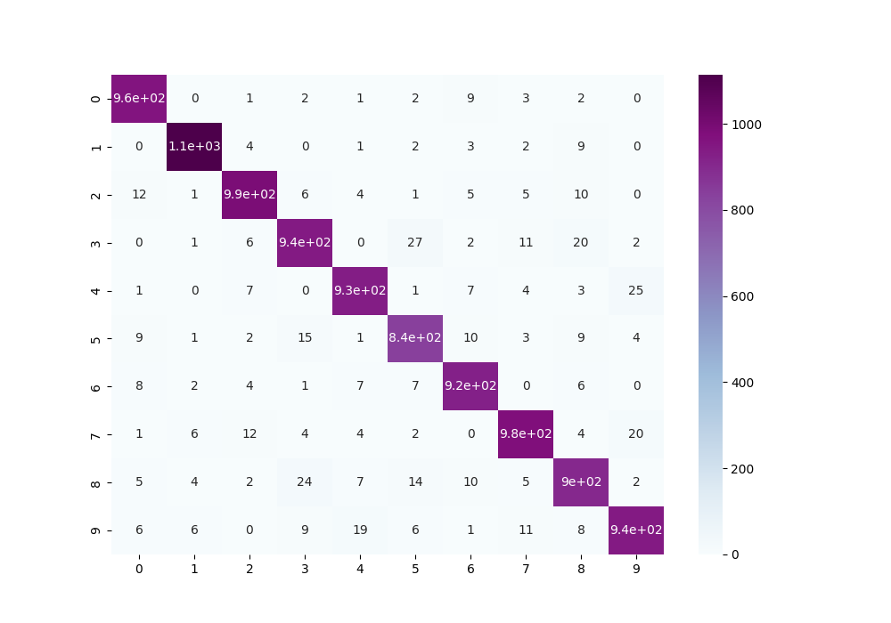  


## 实验二
### 实验要求
- 基于PyTorch实现AlexNet结构
- 在Caltech101数据集上进行验证
- 使用tensorboard进行训练数据可视化，Loss曲线
- 如有条件，尝试不同参数的影响，尝试其他网络结构
- 请勿使用torchvision.models.AlexNet

### 实验实现
- AlexNet
- VGG16
- ResNet50(torchvision.models)
- InceptionV3(torchvision.models)
- DenseNet121(torchvision.models)


### 训练
使用AlexNet对Caltech101分类。
```shell
# 训练AlexNet
python3 ./Experiment2/Code/train.py
# 训练VGG16
python3 ./Experiment2/Code/trainVGG.py
# 训练ResNet50
python3 ./Experiment2/Code/trainResNet.py
# 训练InceptionV3
python3 ./Experiment2/Code/trainInception.py
# 训练DenseNet121
python3 ./Experiment2/Code/trainDenseNet.py

```

### 实验效果

#### AlexNet
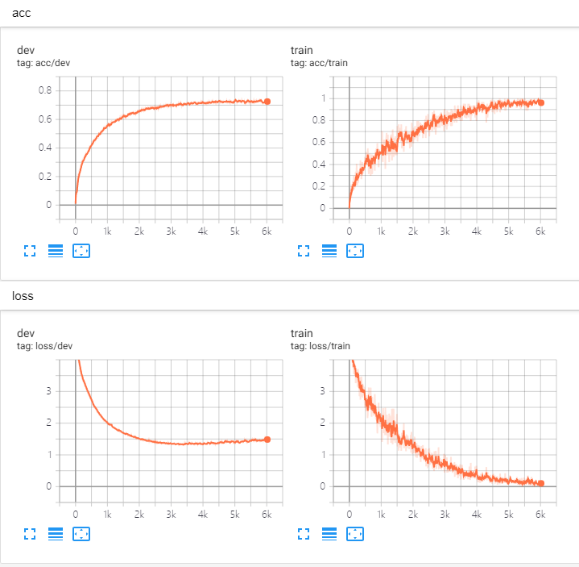  

#### VGG16
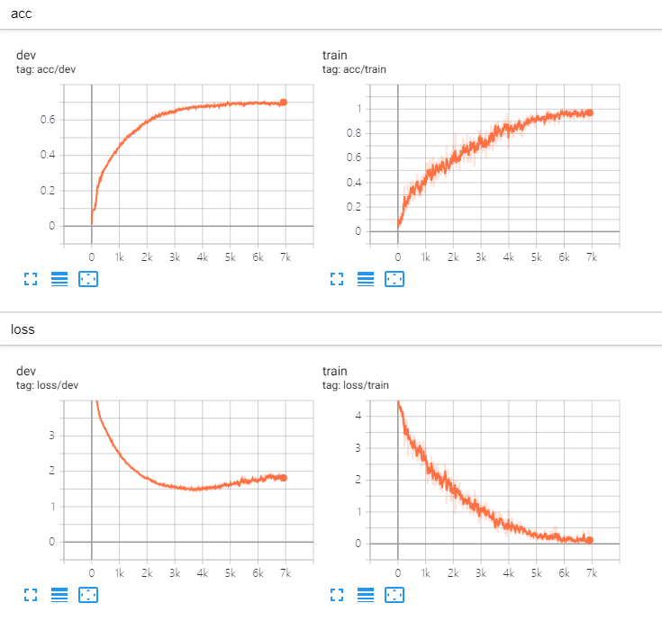  

#### ResNet50
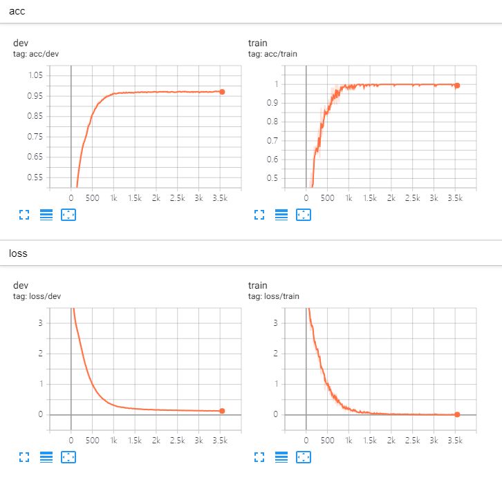  

#### InceptionV3
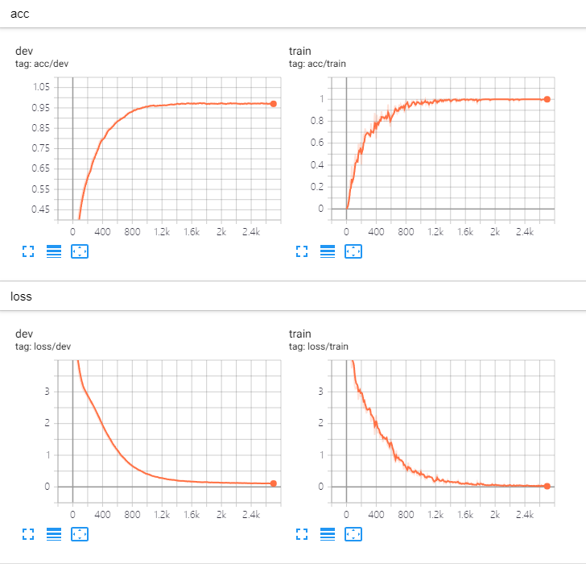  

#### DenseNet121
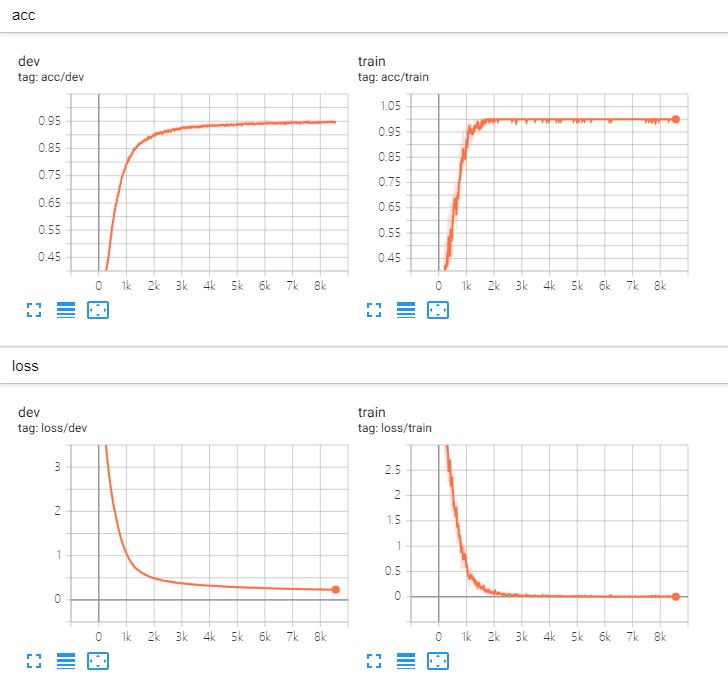  


## 实验三

### 实验要求

#### 基础部分
基于PyTorch实现VGG/ResNet/SENet等结构:  
- 自己实现VGG(11)：要求Conv部分参照论文，可动态调整结构；
- 自己实现ResNet(18)：要求基于残差块，参照论文，可动态调整；
- 在ResNet基础上，添加SE block，对比其性能表现。
- 要求基于CUDA实现，可设定是否使用GPU，通过argparse包实现，默认参数设定为GPU
#### 性能调优  
- 公共部分（选用一个上述最优的模型）
> 1.进行优化器(SGD与Adam)对比；
> 2.进行data augmentation（翻转、旋转、移位等操作）对比。
- 自选部分
> 引入新的模块/换用更好的模型，内容不限，可有效提升性能即可


### 实现

#### 基础部分
- 实现VGG16
- 实现ResNet18、34、50、101、152
- 实现SE-ResNet18、34、50、101、152

#### 性能调优部分
使用Swin Transformer模型，基于预训练模型训练。

### 数据来源
[Plant Seedlings Classification](https://www.kaggle.com/competitions/plant-seedlings-classification)

### 训练
#### 训练参数
|params|options|
|:--:|:--:|
|aug|all/none|
|model|VGG/ResNet/SENet/SwinTransformer|
|mode|train/test/both|
|opt|SGD/Adam|
|dev|cpu/cuda|
|lr|learning_rate:float|
|bs|batch_size:int|
|epoch|epoches:int|
|kf|KFold:int|

#### 相关命令
```shell
python3 ./Experiment3/Code/main.py --mode train --model VGG --opt Adam --aug rot --epoch 100 --bs 128 --lr 1e-5 --dev cuda 
```

### 测试
测试阶段会使用训练阶段训练好的模型测试。  
```shell
python3 ./Experiment3/Code/main.py --mode test --model VGG
```

### 结果
|模型|数据增强|优化器| MicroF1Score | MacroF1Score |KaggleScore|  
|:---:|:------:|:--:|:------------:|:------------:|:---:|
|VGG16|无|Adam|   0.8505    |   0.8276    |0.85390|
|VGG16|数据增强|Adam|0.8421|0.8208|0.8576|
|ResNet18|无|Adam|   0.9284    |   0.9175    |0.92191|
|ResNet18|数据增强|Adam|0.8244|0.8244|0.85894|
|SENet18|无|Adam|   0.9221    |   0.9095    |0.91939|
|SENet18|数据增强|Adam|   0.7273    |   0.6161    |0.84382|
|SwinTransformer|预训练的feature_extractor+Kfold|Adam|0.9728|0.9706|   0.97481    |


## 实验四

### 实验内容
利用Pytorch自己实现RNN、GRU、LSTM和Bi-LSTM不可直接调用nn.RNN(), nn.GRU(), nn.LSTM()。  
利用上述四种结构进行文本多分类，计算测试结果的准确率、召回率和F1值，对比分析四种结构的实验结果。  
任选上述一种结构进行温度预测，使用五天的温度值预测出未来两天的温度值；给出与真实值的平均误差和中位误差。

### 数据来源
将以下数据下载后放入Dataset文件夹下对应名字目录下。  
[online_shopping_10_cats](https://github.com/SophonPlus/ChineseNlpCorpus/blob/master/datasets/online_shopping_10_cats/intro.ipynb)  
[jena_climate_2009_2016](https://www.kaggle.com/datasets/stytch16/jena-climate-2009-2016)  

### 训练
#### 参数
|params|options|
|:--:|:--:|
|data|Text/Weather|
|model|RNN/GRU/LSTM/BiLSTM|
|opt|SGD/Adam|
|lr|learning_rate:float|
|bs|batch_size:int|
|epoch|epoches:int|

#### 文本分类训练
训练FastText词向量模型。  
```shell
python3 ./Experiment4/Code/pretrained.py
```  
数据预处理后即可训练。例如:  
```shell
python3 ./Experiment4/Code/main.py --data Text --model RNN --bs 512 
```

#### 天气预测训练
```shell
python3 ./Experiment4/Code/main.py --data Weather --model LSTM
```

### 文本分类训练效果
在该数据集上训练各种网络的效果
#### RNN
测试集上各个类别的结果  

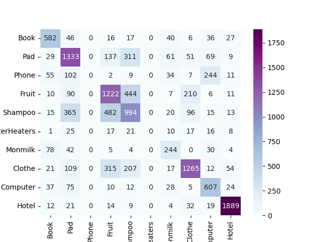    

| class | precision | recall | f1-score | support |
|--:|:--:|:--:|:--:|:--:|
| Book |0.69|0.76|0.72|770|
| Pad |0.60|0.67|0.63|2000|
| Phone |0.00|0.00|0.00|464|
| Fruit |0.55|0.61|0.58|2000|
| Shampoo |0.49|0.50|0.49|2000|
| ElectricWaterHeaters |0.00|0.00|0.00|115|
| Monmilk |0.52|0.60|0.56|407|
| Clothe |0.75|0.63|0.69|2000|
| Computer |0.58|0.76|0.66|798|
| Hotel |0.92|0.94|0.93|2000|
| <b>Accuracy</b> | ||0.65|12554|
| <b>macro avg</b> |0.51|0.55|0.53|12554|
| <b>weighted avg</b> |0.62|0.65|0.63|12554|

#### GRU
测试集上各个类别的结果，对应的confusion matrix如下图所示。  

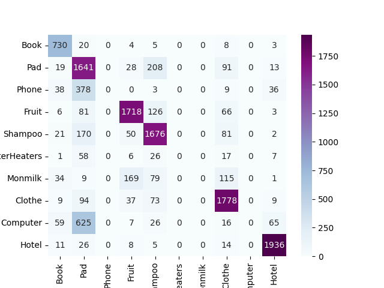    

| class | precision | recall | f1-score | support |
|--:|:--:|:--:|:--:|:--:|
| Book | 0.79 | 0.95 | 0.86 | 770 |
| Pad | 0.53 | 0.82 | 0.64 | 2000 |
| Phone |0.00|0.00|0.00|464|
| Fruit |0.85|0.86|0.85|2000|
| Shampoo |0.75|0.84|0.79|2000|
| ElectricWaterHeaters |0.00|0.00|0.00|115|
| Monmilk |0.00|0.00|0.00|407|
| Clothe |0.81|0.89|0.85|2000|
| Computer |0.00|0.00|0.00|798|
| Hotel |0.93|0.97|0.95|2000|
| <b>Accuracy</b> | ||0.76|12554|
| <b>macro avg</b> |0.47 |0.53|0.49|12554|
| <b>weighted avg</b> | 0.67|0.76|0.70|12554|


#### LSTM
测试集上各个类别的结果，对应的confusion matrix如下图所示。  

    

| class | precision | recall | f1-score | support |
|--:|:--:|:--:|:--:|:--:|
| Book |0.59 |0.93|0.72|770|
| Pad |0.56|0.75|0.64|2000|
| Phone |0.00|0.00|0.00|464|
| Fruit |0.91|0.84|0.88|2000|
| Shampoo |0.65|0.86|0.74|2000|
| ElectricWaterHeaters |0.00|0.00|0.00|115|
| Monmilk |0.00|0.00|0.00|407|
| Clothe |0.86|0.86|0.86|2000|
| Computer |0.00|0.00|0.00|798|
| Hotel |0.90|0.97|0.93|2000|
| <b>Accuracy</b> | ||0.74|12554|
| <b>macro avg</b> | 0.45|0.52|0.48|12554|
| <b>weighted avg</b> |0.65 |0.74|0.69|12554|


#### BiLSTM
测试集上各个类别的结果，对应的confusion matrix如下图所示。  

    

| class | precision | recall | f1-score | support |
|--:|:--:|:--:|:--:|:--:|
| Book | 0.94|0.90|0.92|770|
| Pad |0.78|0.79|0.78|2000|
| Phone |0.76|0.82|0.79|464|
| Fruit |0.90|0.90|0.90|2000|
| Shampoo |0.80|0.83|0.81|2000|
| ElectricWaterHeaters |0.00|0.00|0.00|115|
| Monmilk |0.96|0.95|0.96|407|
| Clothe |0.87|0.88|0.88|2000|
| Computer |0.84|0.85|0.84|798|
| Hotel |0.97|0.96|0.97|2000|
| <b>Accuracy</b> | ||0.87|12554|
| <b>macro avg</b> | 0.78|0.79|0.79|12554|
| <b>weighted avg</b> | 0.86|0.87|0.86|12554|


## 实验五

### 实验要求
- 生成式对抗网络实现
- 隐空间语义方向搜索

### 数据来源
```
./Dataset/points.mat
```
通过可视化，可以发现其为M。


### 实验结果

#### 生成式对抗网络实现
蓝色线条为D的决策面，红色点为points.mat中点的分布，蓝色点为生成的点。  
##### GAN


##### WGAN


##### WGAN-GP


#### 隐空间语义方向搜索

  

<!--    -->

<!--     -->

<!--    -->

<!--    -->


### 参考
[笔记：SeFa，高效提取GAN隐空间的语义信息](https://zhuanlan.zhihu.com/p/165137416)


## 实验六

### 实验选题
实验选题为kaggle上Featured Code Competition，题目为[U.S. Patent Phrase to Phrase Matching](https://www.kaggle.com/competitions/us-patent-phrase-to-phrase-matching/overview).

### 实验数据
#### 训练数据
训练数据如下图所示，对于给定的anchor和target，给出其相匹配的程度，例如，如果一项发明声称是“电视机”，而先前的出版物描述了“电视机”，那么理想情况下，模型会识别出这两者是相同的，并帮助专利律师或审查员检索相关文件。  

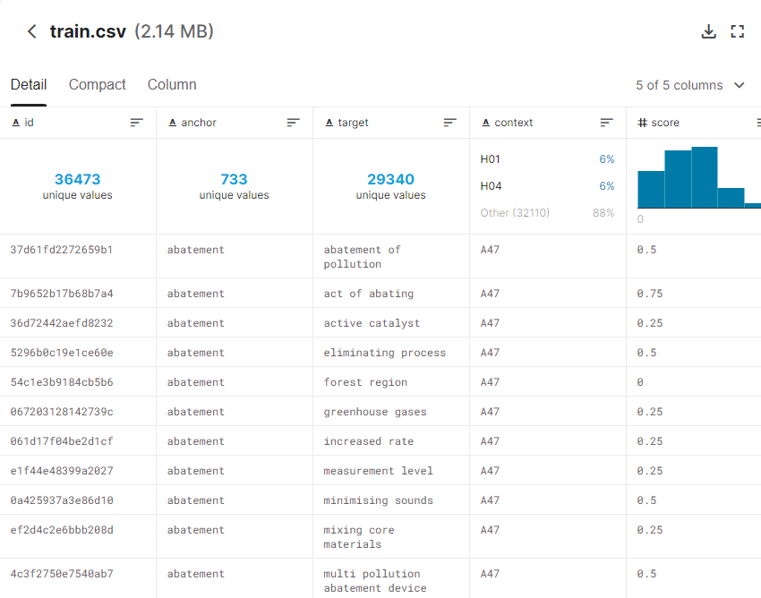  

#### 测试数据
测试数据如下图所示，需要给出anchor和target的相关程度，并给出了相关的上下文的符号。  

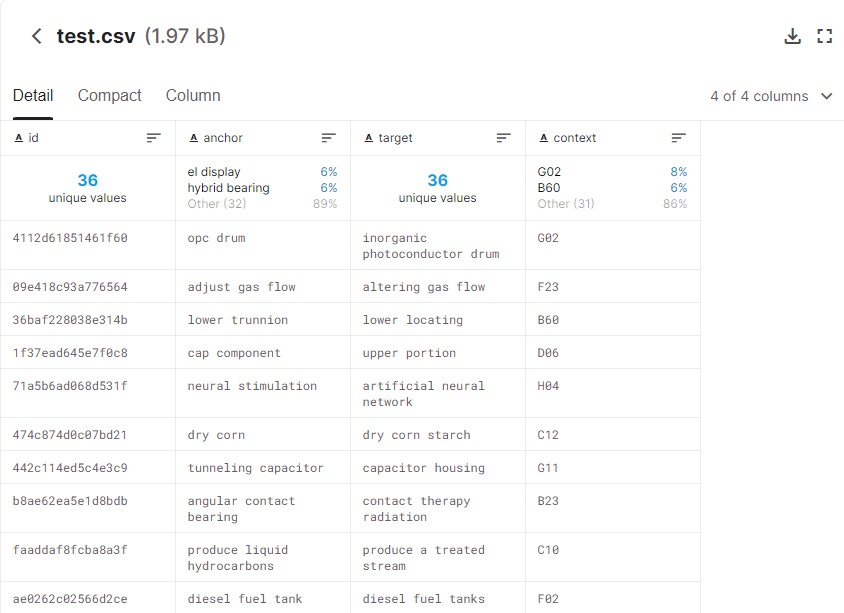  

#### 数据分布
将test中的anchor和target连接到Cooperative Patent Classification Codes Meaning数据中，获取相关的上下文信息，并构建dataset。   
采样数据的分布，使用DeBerta分词器对待分类的句子分词，分词后的数据分布如下:  

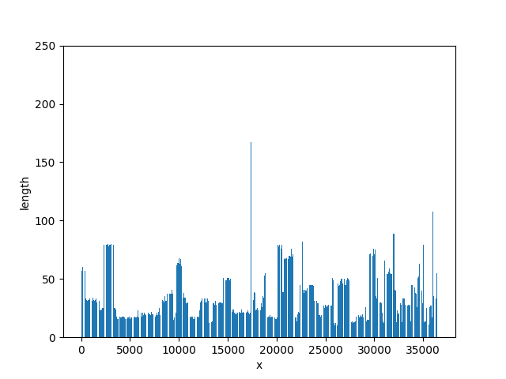  

在后续处理中，将句子截断为100，对不足100的补齐。  


### 实验内容
基于DeBerta构建训练系统。


